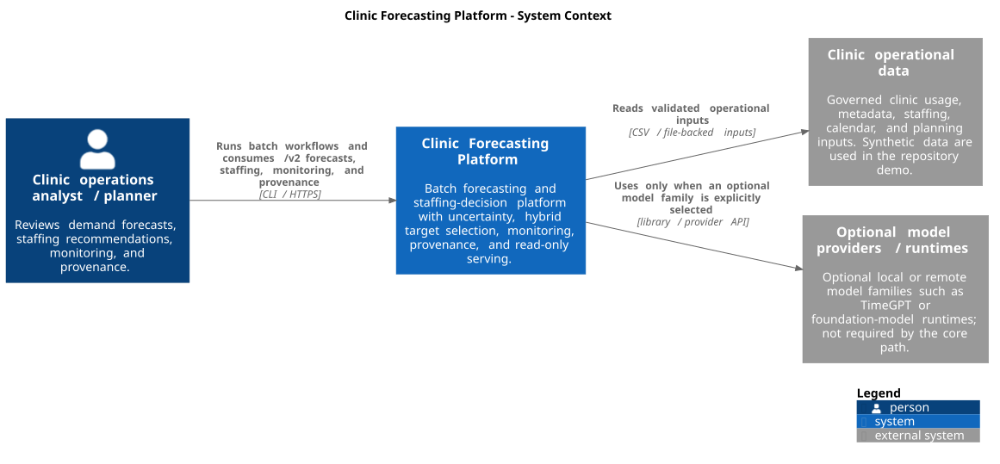
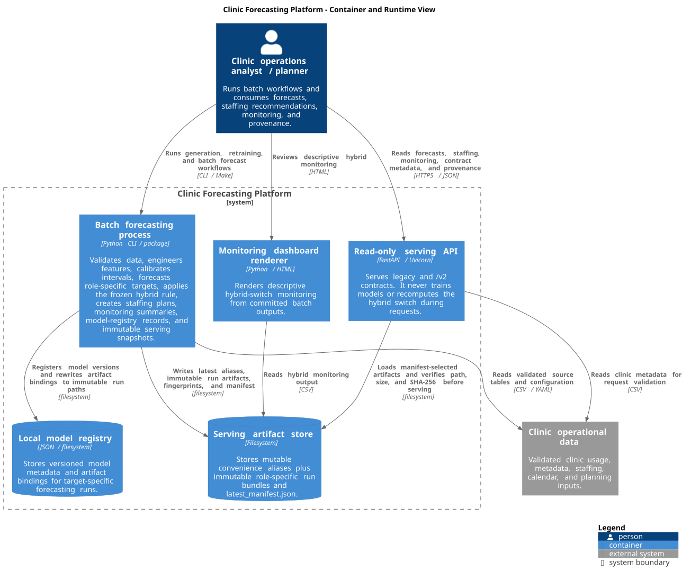
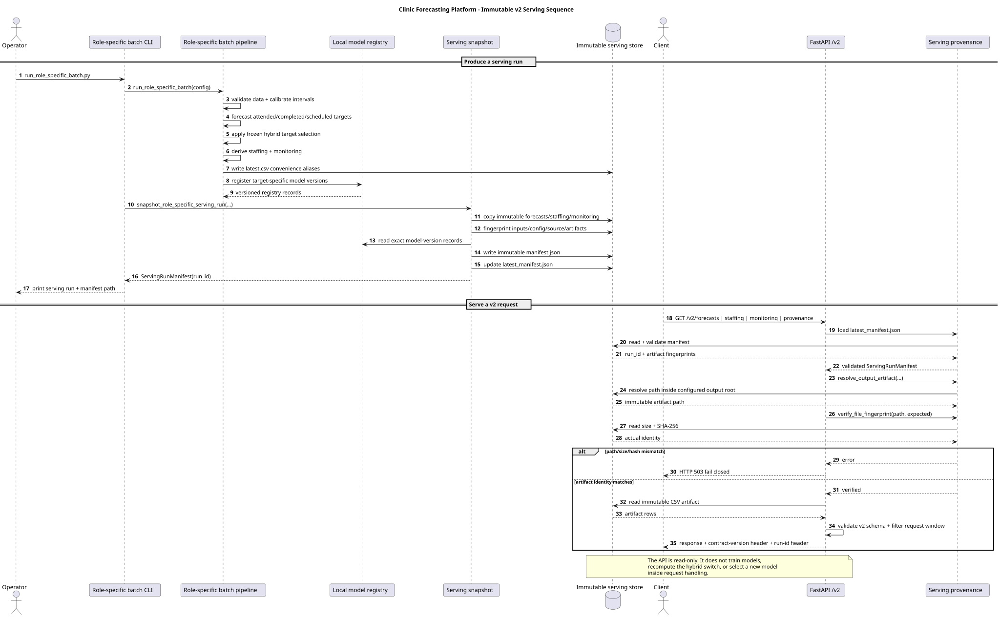

# Architecture

The Clinic Forecasting Platform is a local-first, file-backed proof of concept for batch forecasting, uncertainty-aware staffing decisions, monitoring, provenance, and read-only serving. The repository uses synthetic data, and the architecture below is production-shaped engineering rather than a claim of validated clinical deployment.

The diagrams separate three questions: what sits inside and outside the system, which runtime boundaries actually exist, and how one immutable `/v2` serving run is produced and verified.

## System context



Source: [`architecture/context.puml`](architecture/context.puml)

The primary user is an operations analyst or planner who runs batch workflows and consumes forecasts, staffing recommendations, hybrid monitoring, and provenance. The repository demo reads synthetic, file-backed clinic data behind explicit validation contracts. Optional model providers or heavyweight runtimes are outside the core path and are used only when explicitly selected.

## Container and runtime view



Source: [`architecture/containers.puml`](architecture/containers.puml)

The important runtime distinction is between **batch generation** and **read-only serving**.

The batch forecasting process validates source tables, engineers features, calibrates uncertainty, forecasts attended/completed/scheduled demand, applies the frozen hybrid target rule, derives staffing plans and monitoring summaries, registers target-specific model versions, and creates an immutable serving snapshot.

The FastAPI process is a separate read-only runtime. It serves the legacy and `/v2` contracts from persisted artifacts. It never trains a model, recalibrates an interval, or recomputes the hybrid decision during request handling.

The filesystem is therefore an explicit architectural boundary rather than incidental local state. It contains:

- mutable `latest.csv` aliases for local convenience and backwards compatibility;
- immutable `role_specific/runs/<run_id>/` serving bundles;
- `latest_manifest.json`, which selects the current immutable run;
- the local JSON model registry and versioned registry records.

The Docker image packages the same batch/API code into one demo image. It does not change these logical responsibilities: the default container command runs the API, while batch generation remains an explicit command.

## Data and decision flow

The modelling path remains:

```text
validated clinic data
→ leakage-safe features
→ fixed-origin forecasts
→ split-conformal uncertainty
→ role-specific demand targets
→ frozen capacity-aware hybrid selection
→ staffing recommendations
→ monitoring + immutable serving snapshot
```

The role-specific batch forecasts three demand quantities from the same fixed origin:

- completed visits for throughput and the default clinical target;
- attended demand for capacity-pressured clinical staffing;
- scheduled appointments for front-desk staffing.

For each clinic-day, the frozen hybrid policy compares the 90% upper split-conformal bound for completed visits with known daily clinic capacity. If the upper bound reaches or exceeds capacity, clinicians and nurses are sized from attended demand; otherwise they are sized from completed visits. Front desk always uses scheduled appointments.

The switch is computed in the batch pipeline and persisted as `capacity_pressure` and `hybrid_target`. The serving API only exposes that already-made decision.

## Immutable `/v2` serving provenance



Source: [`architecture/v2-serving-sequence.puml`](architecture/v2-serving-sequence.puml)

A successful role-specific CLI run first produces forecasts, staffing, monitoring, and model-registry records. The snapshot step then creates a collision-resistant run ID and records exact identities for:

- source revision;
- input files;
- generation/staffing configuration;
- target-specific model versions and their registry records;
- forecast, staffing, and monitoring artifacts.

Each file identity includes a relative path, byte size, and SHA-256 digest. The resulting manifest is written both inside the immutable run bundle and as `latest_manifest.json`, which is the serving pointer.

When a provenance manifest exists, `/v2` resolves the artifact selected by that manifest and verifies that its path stays inside the configured output root, its size matches, and its SHA-256 digest matches. A path, size, or digest mismatch fails closed with HTTP 503 instead of serving unverified data.

Successful `/v2` responses expose the serving contract version and, when a manifest is active, the exact serving run through `X-Clinic-Forecast-Run-Id`. `GET /v2/provenance` returns the full manifest after verifying all referenced output artifacts.

For pre-provenance local outputs, the ordinary `/v2` forecast/staffing/monitoring endpoints retain their documented legacy fallback to role-specific `latest.csv` files. `/v2/provenance` itself requires a manifest and returns HTTP 503 when none exists.

## Design choices

- **Contracts at the boundary.** Every dataset is validated against an explicit schema before modelling, so bad data fails loudly and early rather than producing plausible-but-wrong forecasts.
- **One metric definition, shared everywhere.** `metrics.py` is the single source; evaluation code groups and ranks rather than reimplementing metrics.
- **Leakage safety is structural.** Rolling and expanding features operate on shifted per-clinic series; fixed-origin evaluation keeps the holdout future out of recursive lag construction.
- **Target selection is prospective.** Realised `capacity_censored` is evaluation-only. The operational switch uses historical conformal residuals, forecast distributions, and known capacity.
- **Uncertainty drives decisions.** Conformal intervals are part of both the staffing safety margin and the hybrid pressure trigger.
- **Serving semantics are versioned.** Unversioned routes preserve the legacy completed-visits contract; `/v2` exposes the role-specific hybrid contract.
- **Serving is artifact-driven.** Request handling reads and verifies already-produced artifacts; it does not silently rerun science.
- **Provenance is fail-closed.** Once a manifest is present, immutable artifact identity is verified before serving.
- **Production-shaped, not production-validated.** Local file stores, a JSON registry, FastAPI, scheduled rehearsal workflows, and Docker demonstrate operational structure without claiming real-clinic deployment readiness.

## From PoC to production

The notebooks are the analytical narrative; the package under `src/clinic_forecast` is the reusable, tested code. Productionisation would still require, among other things:

- governed real operational data behind the same contracts;
- a defensible real-world source for pre-capacity attended demand;
- the real marketing/planning feed rather than carried-forward assumptions;
- real held-out validation of staffing productivity, cost coefficients, and the frozen hybrid trigger;
- authenticated serving and a durable governed artifact/registry store where required;
- operational ownership, alerting, retention, access control, and rollback procedures;
- prospective validation before forecasts or staffing recommendations influence real rosters.

The current architecture makes those boundaries visible; it does not imply that they have already been satisfied.
